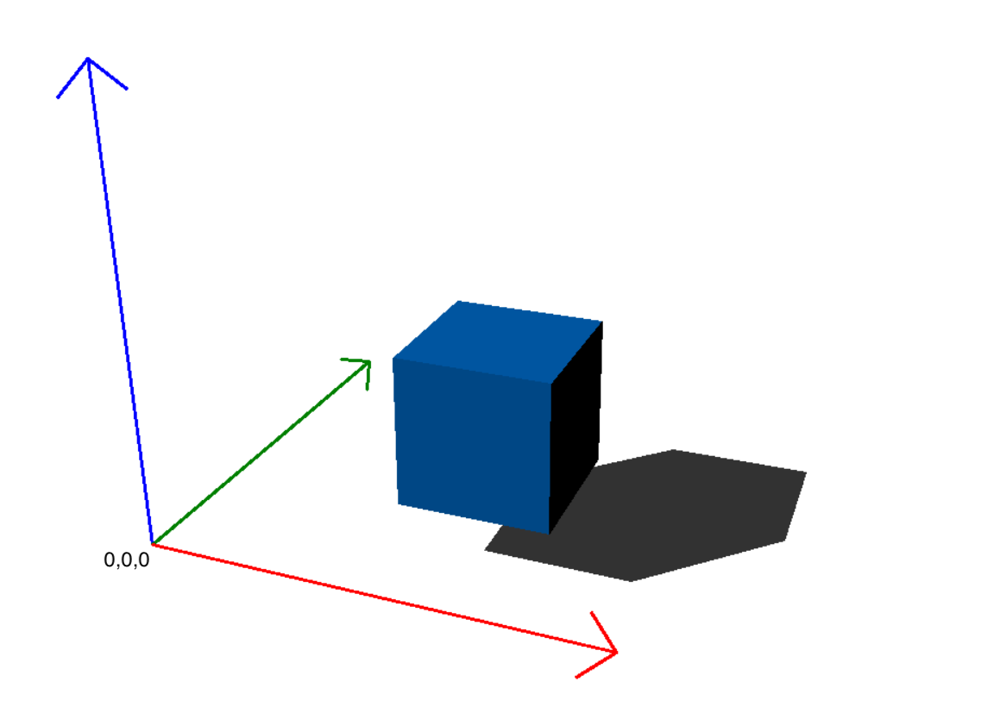

# Basic 3D Engine in Python

This project is a 3D engine written in Python using OpenCV and NumPy. The engine includes features such as backface culling, object clipping, basic lighting, and FPS calculation.

> **Note**: This project is currently under development.

## Getting Started

Before diving into the details, make sure to follow the setup instructions in the [installation guide](./installation.md).

## Understanding the Render Pipeline

To better understand how this 3D engine works, check out the [render pipeline](./pipeline.md). It outlines the step-by-step process that the engine follows to transform and render 3D objects onto the screen.

## Exploring the Modules

## Indices and Tables

Use the indices and search functionality to quickly locate specific information within the documentation.

## Contributing

Contributions are welcome! Please feel free to submit a Pull Request or open an Issue for any bugs or feature requests.

## License

This project is licensed under the MIT License. See the [LICENSE](./LICENSE) file for details.
