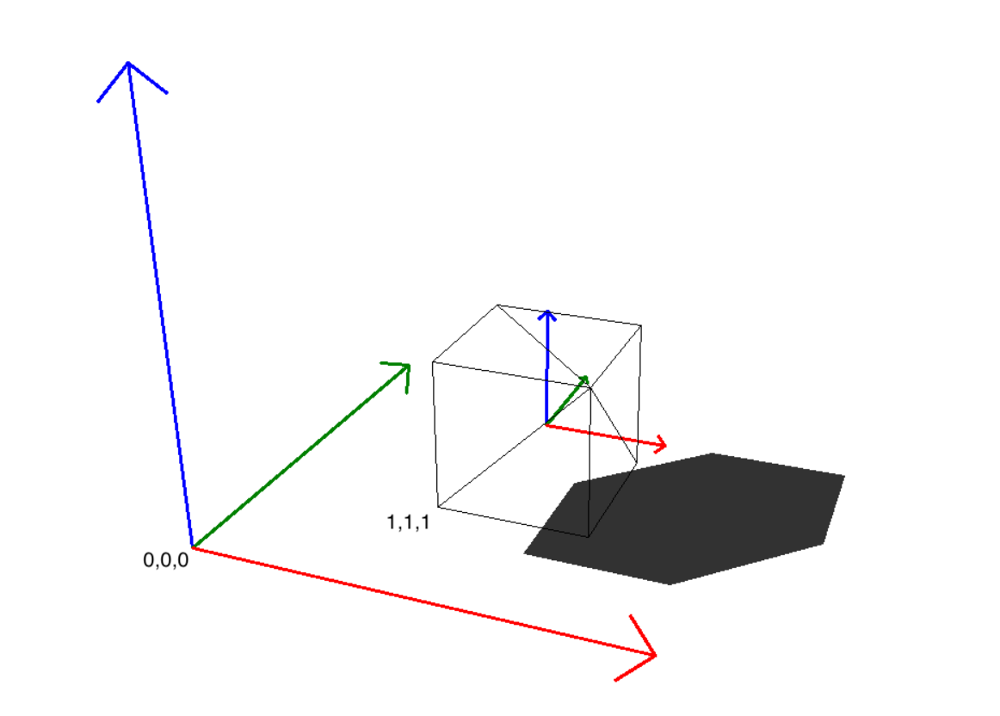
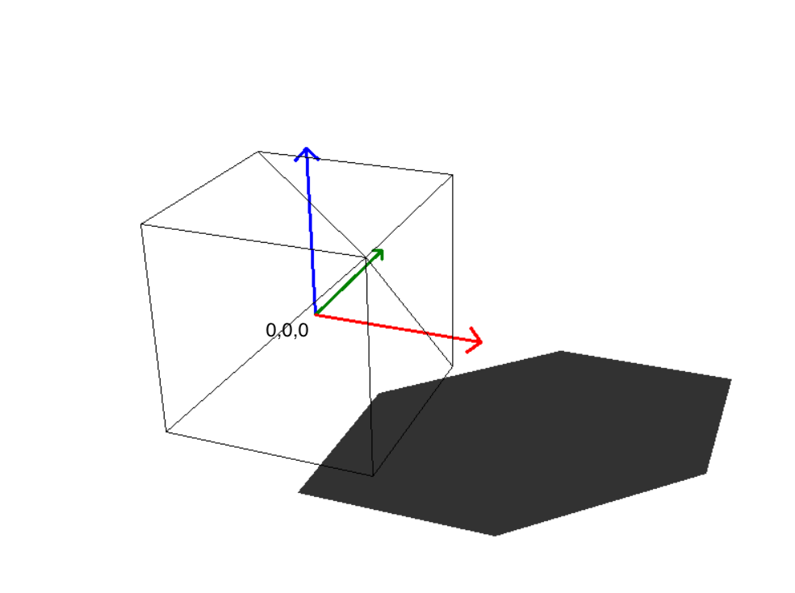
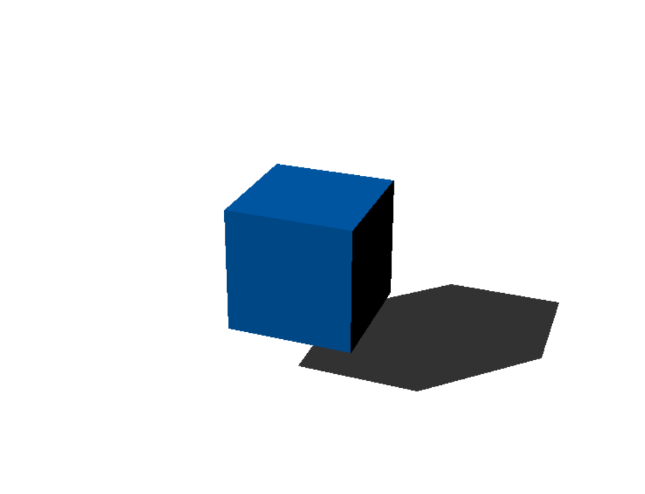

.. _theorie:

3D Engine Overview
==================

Introduction
------------

This document provides an overview of the key concepts in a 3D engine, explaining how 3D and 4D spaces are used, and the roles of world, camera, and cube spaces. It also discusses how each object in the scene operates within its own coordinate system. A unique aspect of this engine is the use of an actual camera simulation model, which replicates the physical properties of a real-world camera.

.. note::
    If you don’t understand everything at first, don’t worry. You don’t need to grasp every detail to explore how a 3D engine works; some aspects can be treated as a 'black box'.

3D and 4D Space
---------------

**3D Space**:
In 3D space, objects are defined using three dimensions: 

- **X (width)**: Represents the horizontal axis.

- **Y (height)**: Represents the vertical axis.

- **Z (depth)**: Represents the axis that gives the sense of depth, moving in and out of the screen.

**4D Space**:
While 3D space is intuitive for representing objects, transformations like translation, rotation, and scaling are more easily handled using **4D space**. This is achieved through the use of **homogeneous coordinates**. In this system, a fourth coordinate (W) is added to a point or vector, allowing for more complex transformations, particularly those involving perspective projections, to be represented as matrix multiplications.
A point in 3D space (X, Y, Z) is represented in 4D space as (X, Y, Z, W), where W is typically set to 1. This value of 1 indicates that the point is not yet scaled; it represents its original, untransformed state.

World, Camera, and Cube Space
-----------------------------

In a 3D engine, multiple coordinate systems are used to represent objects and scenes:

- **World Space**:
  - This is the global coordinate system that defines the positions, orientations, and scales of all objects in the scene. All objects are placed in this space relative to a common origin, typically at (0, 0, 0).

If you want to create a cube like this in your engine, you would place the cube at (1, 1, 1) in global space.
  
.. image:: ../resources/space/world_space.png
  :width: 800

- **Cube Space (Object Space)**:
  - Also known as object space or model space, this is the local coordinate system for each object. Every object in the scene has its own cube space, which simplifies the process of modeling and transforming the object independently of the world space.

This image shows the coordinate system of the cube relative to world space. Notice that the cube is positioned at (1, 1, 1).

This image shows the cube again, but this time with the local coordinate system 
positioned at (0, 0, 0).

- **Camera Space**:
  - After objects are placed in world space, the scene is transformed into camera space. The camera space is centered on the camera itself, with the camera positioned at the origin (0, 0, 0). This transformation allows the scene to be viewed from the perspective of the camera.

This image shows the camera space. Since we are viewing from the camera’s perspective, you can see the normal space. If you imagine the coordinate system, it would align with the screen.

Cartesian vs. Homogeneous Coordinates in 3D Engines
-----------------------------------------------------

**Cartesian Coordinates**

In 3D space, Cartesian coordinates are the most straightforward way to describe a point. A point is typically represented as (x, y, z), where each value corresponds to the position along the X, Y, and Z axes. This system is intuitive and works well for basic positioning and geometry.

However, Cartesian coordinates have limitations when it comes to performing more complex operations such as transformations, especially in the context of 3D graphics. For example, if you want to translate (move) a point in space, you would normally need to add a translation vector to it. This approach requires handling translations separately from other transformations like rotation or scaling, which complicates the mathematical operations involved.

:ref:`-> Example <example>`

**Homogeneous Coordinates**

Homogeneous coordinates solve this problem by adding an additional coordinate, \( w \), to the traditional Cartesian coordinates, resulting in a four-dimensional vector \( (x, y, z, w) \). This extra coordinate, which is typically set to 1, provides two key advantages:

1. **Simplified Transformations**: 

   - **Translation and Scaling**: In homogeneous coordinates, all transformations, including translation, rotation, and scaling, can be represented as matrix multiplications. For instance, to move (translate) a point, you simply apply a translation matrix to the point’s homogeneous coordinates. This avoids the need to separately add translation vectors.
   - **Perspective Projection**: Homogeneous coordinates allow for straightforward perspective projections. By modifying the \( w \) component, you can simulate depth and perspective effects, which are crucial for rendering 3D scenes realistically. After transformation, the homogeneous coordinates are converted back to Cartesian coordinates by dividing each component by \( w \), effectively scaling the point in space based on its depth.

2. **Computational Efficiency**: 
   - Computers are optimized to handle data in powers of 2. Since a 3D vector has three components (x, y, z), which isn’t a power of 2, it is often treated internally as a 4D vector (with an extra coordinate, \( w \), often set to 1). This makes operations on 4D vectors more efficient in terms of processing power.
