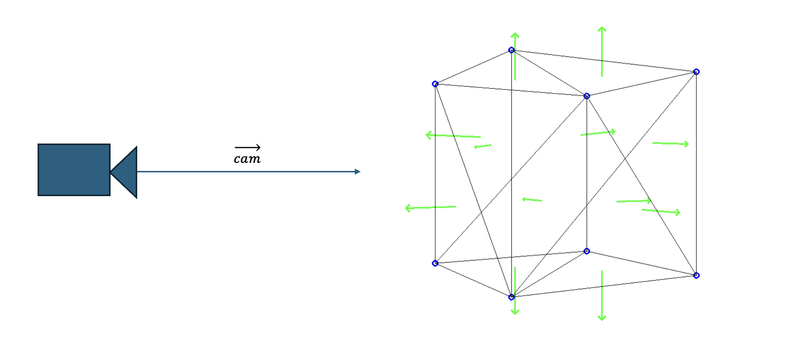
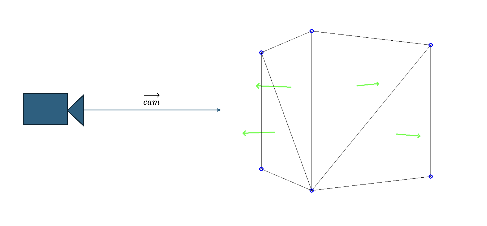
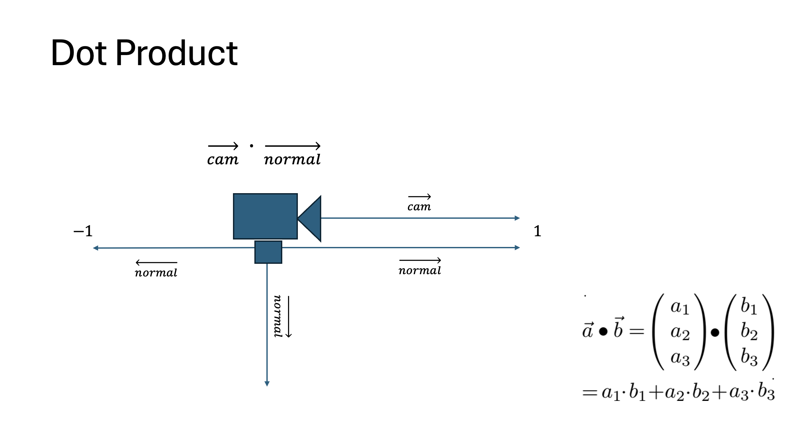

.. _backface_culling_model:

Backface Culling Module
=======================

Backface culling is a computer graphics technique used to improve rendering efficiency by eliminating the need to triangles that are not visible to the camera.
This technique is based on the principle that when an object's surface faces away from the camera, it does not contribute to the final image, and thus, rendering it would be unnecessary and wasteful.

In this module we are dealing with the following code snippet of the Engine Loop:

    .. code-block:: python
        :caption: :mod:`main` method
        :linenos:

        def main(self):

            ...

            for triangle in self.mesh_list:

                triangle.world_points = self.camera_model.world_transform(triangle.points, self.V_T_Cube)
                triangle.normal, normal_start, normal_end, triangle.centroids = CalculateNormal.normal(triangle.world_points)
                transformed_normals = self.camera_model.camera_transform([normal_start, normal_end], self.C_T_V)

                if self.window.show_normals:
                    self.camera_model.draw_camera_image_arrow(transformed_normals[0], transformed_normals[1])

                if self.is_triangle_facing_camera(triangle.normal, triangle.centroids, camera_vector_world) < 0.0:

                        ...

------------------------------------------------------------------------------------------------------------------------

Without Backface Culling the Cube would look like the following:

--------------------------------------------------------------------------------------------------------------------------

With Backface Culling the Cube would look like the following:

I guess you can see the difference. But whats the math behind this technique?

--------------------------------------------------------------------------------------------------------------------------

1. **Surface Normals Calculation**: 
Each polygon in a 3D object has a surface normal, which is a vector perpendicular to the polygon's surface. This normal helps determine the orientation of the polygon relative to the camera.

The normal is calculated the following way, with the help of the cross product:

.. image:: ../resources/culling/cross.png
  :width: 800
  :alt: cross product

.. image:: ../resources/culling/normal.png
  :width: 800
  :alt: normal

.. note::
    a x b (a cross b) is the vector perpendicular to the triangle's surface. This vector is called the normal.

.. warning::
    It is important that all triangle points are clockwise; otherwise, the normals will point in the wrong direction (equivalent to b x a).

Now that we have the surface normals and the normal of the camera (if you missed that, check out the Initialization module), we can move on to the next step.

2. **Dot Product Test**: 

The angle between the surface normal and the camera's view direction is calculated using the dot product. If the result of this dot product is positive (1), it means the polygon is facing away from the camera. If it's negative (-1), the polygon is facing towards the camera.

To keep only the faces visible to the camera, we need to eliminate all faces with a positive dot product. And that's the magic behind this module. Check out the code further down the page.

**Benefits**:

- **Performance Improvement**: By not rendering polygons that aren't visible, the system saves computational resources, allowing for faster rendering and potentially higher frame rates.

- **Simplified Shading**: Since only the visible polygons are processed, the shading and lighting calculations are simplified.

Implemantation
---------------

Now that you know the theoretical math behind this module, let's dive into the implementation.

**Code**

    .. code-block:: python
        :caption: :mod:`main` method
        :linenos:

        def main(self):

            ...

            for triangle in self.mesh_list:

                triangle.world_points = self.camera_model.world_transform(triangle.points, self.V_T_Cube)
                triangle.normal, normal_start, normal_end, triangle.centroids = CalculateNormal.normal(triangle.world_points)
                transformed_normals = self.camera_model.camera_transform([normal_start, normal_end], self.C_T_V)

                if self.window.show_normals:
                    self.camera_model.draw_camera_image_arrow(transformed_normals[0], transformed_normals[1])

                if self.is_triangle_facing_camera(triangle.normal, triangle.centroids, camera_vector_world) < 0.0:

                        ...

------------------------------------------------------------------------------------------------------------

    .. code-block:: python

        for triangle in self.mesh_list:

This line simply cycles through the list of triangles.

------------------------------------------------------------------------------------------------------------

    .. code-block:: python

        triangle.world_points = self.camera_model.world_transform(triangle.points, self.V_T_Cube)

Here, the triangle points will be transformed into world points, which is important for accurately positioning the triangles within the 3D space and calculating the normals.

    .. method:: world_transform(triangle, V_T_Cube)

        **Parameters:**

        - `triangle`: A list of points representing the triangle.
        
        - `V_T_Cube`: The transformation matrix from the cube to the world.

        **Returns:**
        - The transformed triangle points.

        .. code-block:: python
            :caption: :mod:`world_transform` method

            @staticmethod
            def world_transform(triangle, V_T_Cube):
                transformed_triangles = []

                for point in triangle:
                        transformed_triangle = V_T_Cube @ point
                        transformed_triangles.append(transformed_triangle)

                return transformed_triangles

------------------------------------------------------------------------------------------------------------

    .. code-block:: python

        triangle.normal, normal_start, normal_end, triangle.centroids = CalculateNormal.normal(triangle.world_points)

Next, the normals will be calculated using the world space points.

    .. method:: normal(triangle, scale = 0.5)

        **Parameters:**

        - `triangle`: A list of points representing the triangle.
        
        - `V_T_Cube`: The transformation matrix from the cube to the world.

        **Returns:**
        - The transformed triangle points.

        .. code-block:: python
            :caption: :mod:`world_transform` method

            class CalculateNormal:

                @staticmethod    
                def vector(point1, point2):
                    return point2 - point1
                
                @staticmethod
                def DEG_TO_RAD(deg: float) -> float:
                    return deg*(pi/180.0)
                

                @staticmethod
                def normal(triangle, scale = 0.5):
                            
                    p1 = triangle[0].flatten()
                    p1 = p1[:3]

                    p2 = triangle[1].flatten()
                    p2 = p2[:3]

                    p3 = triangle[2].flatten()
                    p3 = p3[:3]

                    # vectors
                    vec1 = CalculateNormal.vector(p1, p2)
                    vec2 = CalculateNormal.vector(p1, p3)
                    
                    # normal vector
                    normal_vector = np.cross(vec1, vec2)
                    
                    # normalize to unit length
                    norm = np.linalg.norm(normal_vector)
                    if norm == 0:
                        norm = 0.5
                    
                    normalized_normal = normal_vector / norm
                    
                    # mid of triangle
                    centroid = (p1 + p2 + p3) / 3

                    # scale vector
                    scaled_normal = normalized_normal * scale

                    #z,x,y
                    scaled_normal = (scaled_normal[0], scaled_normal[1], scaled_normal[2])

                    normal_start = centroid
                    normal_end = centroid + scaled_normal

                    # reshape to project struct.
                    normal_start = np.vstack([normal_start.reshape(-1, 1), [[1]]])
                    normal_end = np.vstack([normal_end.reshape(-1, 1), [[1]]])

                    return scaled_normal, normal_start, normal_end, centroid

------------------------------------------------------------------------------------------------------------

    .. code-block:: python

        transformed_normals = self.camera_model.camera_transform([normal_start, normal_end], self.C_T_V)

To draw the normals on the screen, they need to be transformed back into camera space before rendering.

    .. method:: transform_normals_to_world_space(normals, V_T_Cube)

        **Parameters:**

        - `normals`: The normal vectors in camera coordinates.

        - `V_T_Cube`: The transformation matrix from the cube to the world.

        **Returns:**
        
        - The transformed normal vectors in world coordinates.

        .. code-block:: python
            :caption: :mod:`transform_normals_to_world_space` method

            @staticmethod
            def transform_normals_to_world_space(normals, V_T_Cube):
                normals_in_world_space = V_T_Cube[:3, :3] @ normals
                return normals_in_world_space

These normals are added to the final image if you have enabled that feature.

    .. code-block:: python
        
        if self.window.show_normals:
            self.camera_model.draw_camera_image_arrow(transformed_normals[0], transformed_normals[1])

------------------------------------------------------------------------------------------------

    .. code-block:: python

        if self.is_triangle_facing_camera(triangle.normal, triangle.centroids, camera_vector_world) < 0.0:

Lastly the Dot Product is used to keep only the faces visible to the camera, we need to eliminate all faces with a positive dot product. Therefore we use the following function:

    .. method:: is_triangle_facing_camera(normal, tri, cam)

        **Parameters:**
        - `normal`: The normal vector of the triangle.
        - `tri`: The centroid of the triangle.
        - `cam`: The camera position vector.

        **Returns:**

        - The dot product, indicating whether the triangle is facing the camera (negative value) or not (positive value).

        **Code:**

        .. code-block:: python
            :caption: :mod:`is_triangle_facing_camera`

            def is_triangle_facing_camera(self, normal, tri, cam):
                dot_product = ( normal[0] * (tri[0] - cam[0]) +
                                normal[1] * (tri[1] - cam[1]) +
                                normal[2] * (tri[2] - cam[2])   )
                return dot_product

Only triangles with a dot product less than 0.0 are further processed.