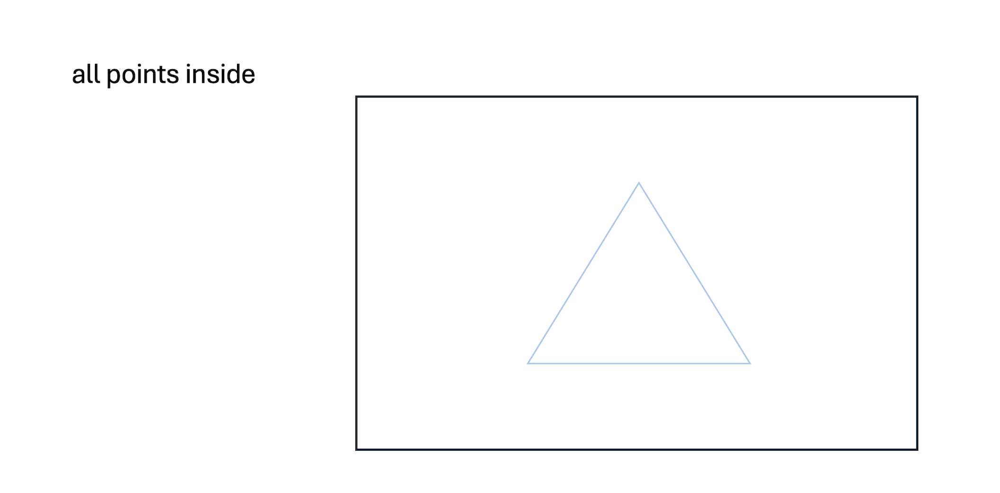
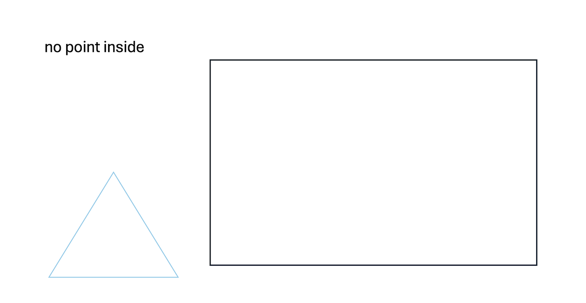
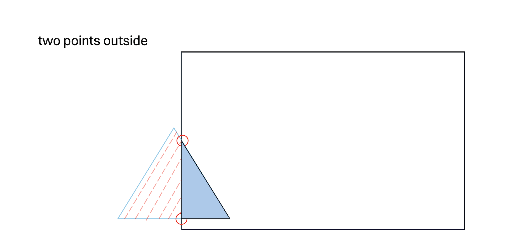
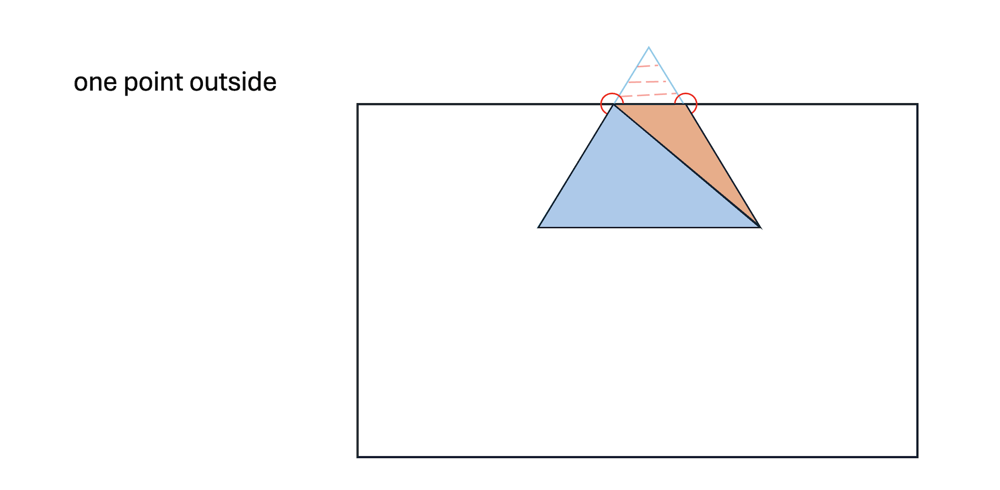
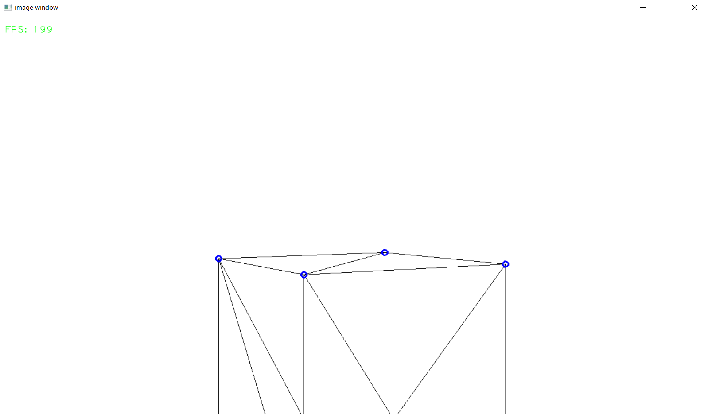
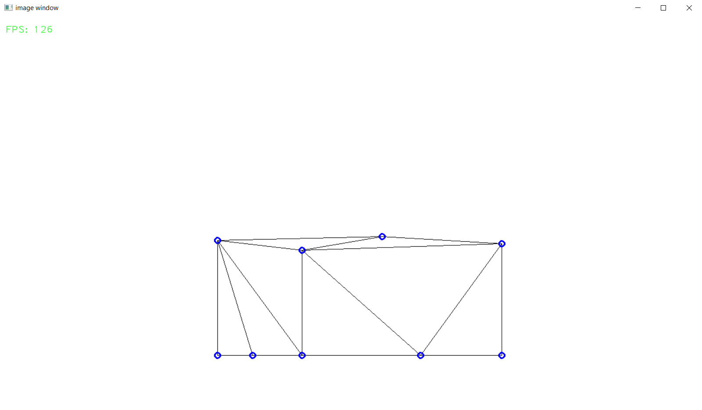
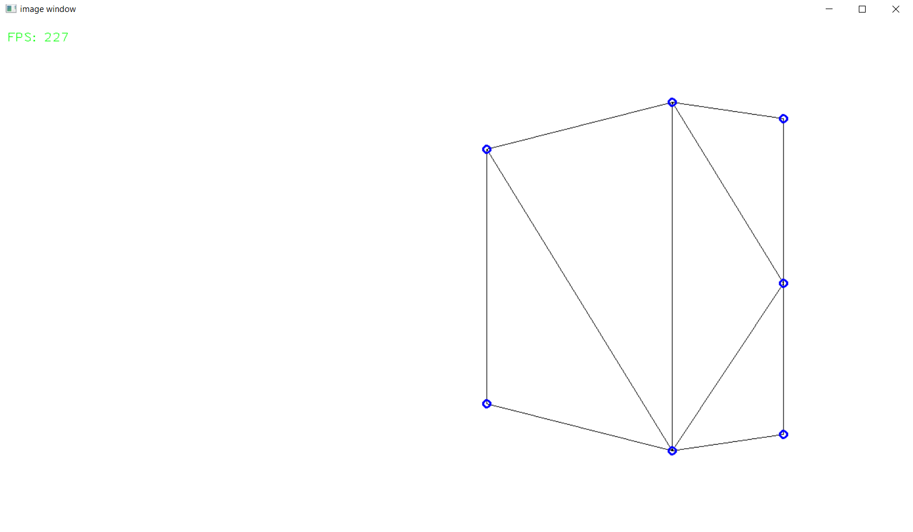

.. _clipping_module:

Frustum Clipping
================

This module explains the view frustum and the clipping of it. This optimizes performance and avoids unnecessary calculations for off-screen elements.

In this module we are dealing with the following code snippet of the Engine Loop:

    .. code-block:: python
        :caption: :mod:`main` method
        :linenos:

        def main(self):

            ...
            
            clipped_triangles = []
            clipped_triangles.extend(self.clipping_space.cube_in_space(sorted_list))

            ...

------------------------------------------------------------------------------------------------------------------------

First of all, the view frustum represents what the user can see, similar to how your eyes can only see what's in front of you. Sometimes, objects are partially or completely outside of this view, so these objects either **don't need to be rendered at all or only partially rendered**.

    .. image:: ../resources/clipping/ViewFrustum.png
        :width: 800
        :alt: The view frustum is defined by six planes: left, right, top, bottom, far, and near.

------------------------------------------------------------------------------------------------------------------------

Clipping Cases
---------------
In a 3D engine, there are four common clipping cases:

- Triangle Fully Inside: The entire triangle is within the screen, so it is rendered.

- Triangle Fully Outside: No part of the triangle is within the view frustum, so it is not rendered.

- Two Points Outside: Two points of the triangle are outside the frustum, so a new triangle is generated.

- One Point Inside: One point of the triangle is inside the frustum, so two new triangles are generated.

.. warning::

    In the second case, there are instances where all points are outside the frustum, but the sides of the triangle are still visible within it. This scenario is not yet implemented. However, there’s a simple fix: each triangle needs to be clipped against each plane of the view frustum, not just once. If you’re unfamiliar with clipping, read further.

------------------------------------------------------------------------------------------------------------------------

But what's the magic behind this "clipping"?

It's actually quite simple. 

Normalized Device Coordinates (NDC) refer to a coordinate system where the positions of points are mapped within a fixed range, typically between -1 and 1 on all axes (x, y, and z). This normalization ensures that regardless of the screen's resolution or size, the points are consistently mapped within this range. In other words, the points are scaled so that they fit within a standardized space, making it easier to perform clipping.

With this normalization, we can set the **borders from 1 to -1 (screen borders)** and then test each triangle against each plane (top, bottom, left, right) of the view frustum. If the triangle crosses any of these defined borders, new triangles are generated to fit within the view. If you're still unsure, check out these examples:

.. note:: 
    Later in this module, we transfer our points back to world space. In other projects, you can use the normalized points, multiply them by your screen resolution, and your rendering is essentially complete. However, since we are using a 'simulated camera' in our 3D model, we need to process our points further.

.. note::
    In the following photos, the border is set to 0.7, which is not the screen's edge but rather an inner boundary. This adjustment is made for demonstration purposes to show that the clipping functionality is working.

------------------------------------------------------------------------------------------------------------------------

Implemantation
---------------

First, our triangles need to be normalized to obtain the NDC (Normalized Device Coordinates) points. So we are creating a matrix to set the fov and screen ration in relation.

.. code-block:: python
    :linenos:

    class Clipping_Space:
    def __init__(self) -> None:

        fov = np.deg2rad(64/1.77)
        aspect_ratio = 1.77
        near = 1
        far = 100.0
        self.projection_matrix = self.create_perspective_projection_matrix(fov, aspect_ratio, near, far)
        self.border = 1

    def create_perspective_projection_matrix(self, fov, aspect_ratio, near, far):
        
        f = 1.0 / np.tan(fov / 2)
        nf = 1 / (near - far)
        
        return np.array([
            [f / aspect_ratio, 0, 0, 0],
            [0, f, 0, 0],
            [0, 0, (far + near) * nf, (2 * far * near) * nf],
            [0, 0, -1, 0]
        ])

------------------------------------------------------------------------------------------------------------------------

Next our points of the triangles will be multiplied with the matrix and divided by the w component to generate the Normalized Device Coordinates.

.. code-block:: python
    :linenos:

    def cube_in_space(self, cube_points: list):

        full_triangle_list = []

        #for each triangle:
        for triangle in cube_points:

            full_point_list = []
            inside_point = []
            outside_point = []

            for point in triangle.camera_points:
                clip_space_point = np.matmul(self.projection_matrix, point)
                ndc_point = clip_space_point / clip_space_point[3]

------------------------------------------------------------------------------------------------------------------------

Now that we have the NDC points, we can test whether these points are inside the view frustum. Since the points are normalized, we can assume that our screen bounds are between 1 and -1. In our code, :mod:`self.border` is set to 1 to reflect these normalized bounds.

.. code-block:: python
    :linenos:

    #check which points are in space
    if -self.border <= ndc_point[0] <= self.border and -self.border <= ndc_point[1] <= self.border and 1 <= ndc_point[2] <= 100:
        inside_point.append(ndc_point)
    else:
        outside_point.append(ndc_point)

------------------------------------------------------------------------------------------------------------------------

Now we have two arrays: one with the points inside the view frustum and one with the points outside. The lengths of these arrays can be used to handle the clipping cases we discussed earlier.

The first two cases are pretty simple:

.. code-block:: python
    :caption: :mod:`main` method
    :linenos:
    
    #all points inside -> return triangle
    if len(inside_point) == 3:
        full_triangle_list.append(triangle)

    #no points inside -> return none
    elif len(inside_point) == 0:
        continue

------------------------------------------------------------------------------------------------------------------------

The last two cases are a bit more complex. First, consider the case where two points are outside the view frustum:

.. code-block:: python
    :linenos:

    #one point inside -> two new points
    elif len(inside_point) == 1:
        _, new_point1 = self.find_intersection_with_plane(inside_point[0], outside_point[0])
        _, new_point2 = self.find_intersection_with_plane(inside_point[0], outside_point[1])

        full_point_list.append(inside_point[0])
        full_point_list.append(np.vstack([new_point1.reshape(-1, 1), [[1]]]))
        full_point_list.append(np.vstack([new_point2.reshape(-1, 1), [[1]]]))

        for pos, point in enumerate(full_point_list):

            full_point_list[pos] = self.transfer_back_camera_space(point)
            triangle.camera_points = full_point_list

        full_triangle_list.append(triangle)

We need to find two additional points to build a new triangle from the existing points. To do this, we use a method to calculate the intersection between the two sides of the triangle that cross the view frustum. These intersection points become the new vertices of the triangle. After constructing the new triangle, we modify the existing one and then convert all the points back to world space.

To understand the two methods I mentioned, check out the details at the bottom of the page.

------------------------------------------------------------------------------------------------------------------------

Next, consider the case where one point is outside of the view frustum:

.. code-block:: python
    :linenos:

    #two points inside -> two new triangles
    elif len(inside_point) == 2:
        _, new_point1 = self.find_intersection_with_plane(inside_point[0], outside_point[0])
        _, new_point2 = self.find_intersection_with_plane(inside_point[1], outside_point[0])

        # First triangle
        full_point_list = []
        full_point_list.append(np.vstack([new_point1.reshape(-1, 1), [[1]]]))
        full_point_list.append(np.vstack([new_point2.reshape(-1, 1), [[1]]]))
        full_point_list.append(inside_point[0])
                
        for pos, point in enumerate(full_point_list):
            full_point_list[pos] = self.transfer_back_camera_space(point)
                
        triangle_new1 = copy.deepcopy(triangle)
        triangle_new1.camera_points = full_point_list
        full_triangle_list.append(triangle_new1)
                
        # Second triangle
        full_point_list = []
        full_point_list.append(inside_point[0])
        full_point_list.append(np.vstack([new_point2.reshape(-1, 1), [[1]]]))
        full_point_list.append(inside_point[1])
                
        for pos, point in enumerate(full_point_list):
            full_point_list[pos] = self.transfer_back_camera_space(point)
                
            triangle_new2 = copy.deepcopy(triangle)
            triangle_new2.camera_points = full_point_list
            
            full_triangle_list.append(triangle_new2)

We need to find two additional triangles. To do this, we first create a new triangle using the same method as before. Once the first new triangle is created, we use its points to form a second triangle. Since the new triangles **share the same normals and colors as the original**, we need to create a deep copy of the old triangle.

To understand the two methods I mentioned, check out the details at the bottom of the page.

------------------------------------------------------------------------------------------------------------------------

.. method:: find_intersection_with_plane(self, point1, point2)

This method is useful for determining where a line segment intersects the edges of a plane. It essentially constructs a line from our two points and checks where this line intersects the plane in 2D space.

    .. code-block:: python
        :linenos:
            
        @staticmethod
        def intersection_with_plane_x(A, B, x):
            if A[0] == B[0]:
                return None
            t = (x - A[0]) / (B[0] - A[0])
            if 0 <= t <= 1:
                intersection = A + t * (B - A)
                return intersection
            return None

        @staticmethod
        def intersection_with_plane_y(A, B, y):
            if A[1] == B[1]:
                return None
            t = (y - A[1]) / (B[1] - A[1])
            if 0 <= t <= 1:
                intersection = A + t * (B - A)
                return intersection
            return None

        def find_intersection_with_plane(self, point1, point2):

            planes_x = [-self.border, self.border]
            planes_y = [-self.border, self.border]

            A = point1.flatten()
            A = A[:3]
            B = point2.flatten()
            B = B[:3]

            #get intersections with borders
            intersections = {
                "left": self.intersection_with_plane_x(A, B, planes_x[0]),
                "right": self.intersection_with_plane_x(A, B, planes_x[1]),
                "bottom": self.intersection_with_plane_y(A, B, planes_y[0]),
                "top": self.intersection_with_plane_y(A, B, planes_y[1])
            }

            #delete points with "None"
            valid_intersections = {}
            for plane, point in intersections.items():
                if point is not None:
                    valid_intersections[plane] = point

            if not valid_intersections:
                return None, None

            #get closest border
            closest_intersection = min(valid_intersections, key=lambda k: np.linalg.norm(valid_intersections[k] - A))

            return closest_intersection, valid_intersections[closest_intersection]
        

------------------------------------------------------------------------------------------------------------------------

.. method:: transfer_back_camera_space(self, point):

This method is used to convert our NDC points back to world space by applying the inverse of the transformation matrix.

    .. code-block:: python
        :linenos:

        def transfer_back_camera_space(self, point):
            # Invert the projection transformation
            converted_point = np.matmul(np.linalg.inv(self.projection_matrix), point)
            converted_point /= converted_point[3]  # Normalize by w to get back the original point
            #print("Back to Homogeneous Point:", final)

            return converted_point

            