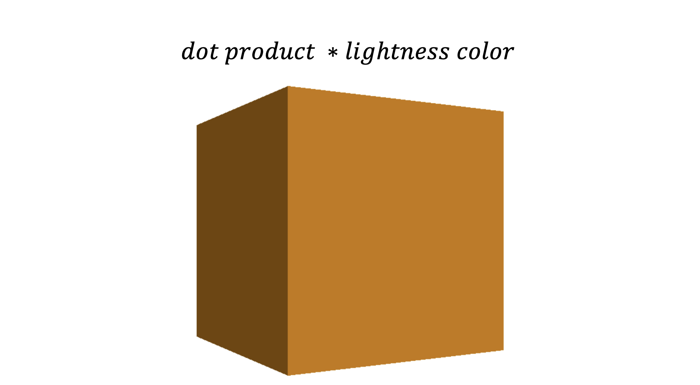

.. _light_module:

Lighting Calculations
=====================

Last time, we eliminated the triangles that are not visible to the camera. We will now use the remaining triangles for further processing and color calculation.

In this module we are dealing with the following code snippet of the Engine Loop:

    .. code-block:: python
        :caption: :mod:`main` method
        :linenos:

        def main(self):

            ...

            if self.is_triangle_facing_camera(triangle.normal, triangle.centroids, camera_vector_world) < 0.0:

                light_direction = (1, -0.5, -0.8)
                triangle.ilm = Color.intensity(light_direction, triangle.normal)
                triangle.color = Color.adjust_bgr_intensity(Color.ALICE_BLUE, triangle.ilm)

                triangle.camera_points = self.camera_model.world_transform(triangle.world_points, self.C_T_V)
                visiable_triangles.append(triangle)

            ...

The idea behind this module is quite simple. We use the dot product to determine how much the triangle and light vector overlap, and then use this value to adjust the color lightness.

------------------------------------------------------------------------------------------------------------------------

We‘ll use the same math for the dot product as explained in the last module.

.. image:: ../resources/light/dot.png
  :width: 800
  :alt: without Backface Culling

--------------------------------------------------------------------------------------------------------------------------

The final colored cube will look like this:

--------------------------------------------------------------------------------------------------------------------------

Now that you know the theoretical math behind this module, let's dive into the implementation.

**Code**

    .. code-block:: python
        :caption: :mod:`main` method
        :linenos:

        def main(self):

            ...

            if self.is_triangle_facing_camera(triangle.normal, triangle.centroids, camera_vector_world) < 0.0:

                light_direction = (1, -0.5, -0.8)
                triangle.ilm = Color.intensity(light_direction, triangle.normal)
                triangle.color = Color.adjust_bgr_intensity(Color.ALICE_BLUE, triangle.ilm)

                triangle.camera_points = self.camera_model.world_transform(triangle.world_points, self.C_T_V)
                visiable_triangles.append(triangle)

            ...

------------------------------------------------------------------------------------------------------------

    .. code-block:: python

        light_direction = (1, -0.5, -0.8)

Here, we define the light vector (referred to as a `point light <https://academyofanimatedart.com/lights-and-shadows-cg-lighting-types-for-3d-animation/>`_). 

------------------------------------------------------------------------------------------------------------

    .. code-block:: python

        triangle.ilm = Color.intensity(light_direction, triangle.normal)

So in this line, we assign the dot product of the light vector and the triangle vector to each triangle.

    .. method:: intensity()
    
    - This method computes the intensity of light as the dot product between the normalized light direction and the normal vector.

    - The result is then negated to ensure that positive values indicate illumination.

    .. note::
        The 'light intensity' is controlled by the Lightness component of the HSL model, which is why the :mod:`bgr_to_hsl` and :mod:`hsl_to_bgr` methods are used.

    .. code-block:: python
        :caption: :mod:`intensity` method

        @staticmethod
        def intensity(light_direction, normal):
            norm = np.linalg.norm(light_direction)
            normalized_light_direction = light_direction / norm
            intensity = np.dot(normalized_light_direction, normal) * (-1)
            return intensity

------------------------------------------------------------------------------------------------

    .. method:: bgr_to_hsl()

    - Converts a BGR color tuple to an HSL (Hue, Saturation, Lightness) representation.

    .. code-block:: python
        :caption: :mod:`bgr_to_hsl` method

        @staticmethod
        def bgr_to_hsl(b, g, r):
            return colorsys.rgb_to_hls(r/255.0, g/255.0, b/255.0)

------------------------------------------------------------------------------------------------

   .. method::  hsl_to_bgr()

    - Converts HSL values back to a BGR tuple.

    .. code-block:: python
        :caption: :mod:`hsl_to_bgr` method

        @staticmethod
        def hsl_to_bgr(h, l, s):
            r, g, b = colorsys.hls_to_rgb(h, l, s)
            return int(b * 255), int(g * 255), int(r * 255)

------------------------------------------------------------------------------------------------

Lastly, in this module, the computed dot product of the two vectors is multiplied by the Lightness component of the HSL model.

    .. method:: adjust_bgr_intensity()

    .. code-block:: python
        :caption: :mod:`adjust_bgr_intensity` method

        @staticmethod
        def adjust_bgr_intensity(base_color, intensity):
            B, G, R = base_color
            H, L, S = Color.bgr_to_hsl(B, G, R)
            new_L = L * intensity
            new_B, new_G, new_R = Color.hsl_to_bgr(H, new_L, S)
            return (new_B, new_G, new_R)