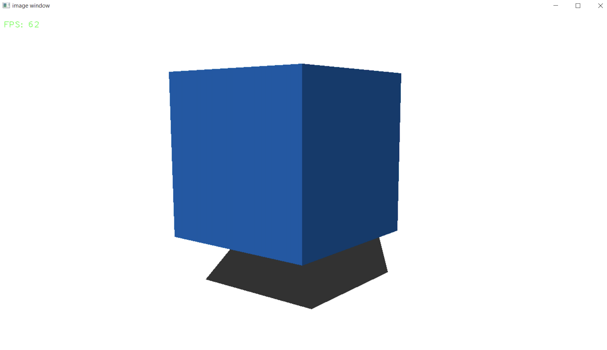

.. _shadow:

Shadow
=====================

In this module, I will explain the basic concept behind our shadow calculation.

In this module we are dealing with the following code snippet of the Engine Loop:

    .. code-block:: python
        :caption: :mod:`main` method
        :linenos:

        ...

            shadow_points = Shadow.get_shadow(self.mesh_list, light_direction)
            shadow_points_camera = self.camera_model.world_transform(shadow_points, self.C_T_V)
            self.camera_model.draw_poly(shadow_points_camera)

            ...

The shadow calculation is actually quite simple. 

- We take the world points of the triangle and apply the light vector to them. 

- Then, we calculate the intersection of this line with the ground plane.

-------------------------------------------------------------------------------------------------------

.. class:: Shadow()

This class provides static methods to calculate the shadow projections of 3D triangles onto a plane.

**Methods:**

.. method:: get_shadow(triangles, light_vec)

    This method calculates the shadow projection of triangles onto a plane based on a given light vector.

    **Parameters:**
    - `triangles (list)`: A list of triangle objects, where each triangle contains a list of 3D world points.
    - `light_vec (np.ndarray)`: A 3D vector representing the direction of the light source.

    **Returns:**
    - `list of np.ndarray`: A list of points representing the shadow projection on the plane.

    .. code-block:: python
        :caption: :mod:`get_shadow` method

        @staticmethod
        def get_shadow(triangles, light_vec):

            shadow_points = []
            plane_normal = np.array([0, 0, 1])

            for triangle in triangles:
                for point in triangle.world_points:
                    shadow_points.append(Shadow.find_intersection(plane_normal, point[:3].flatten(), light_vec))

            unique_array = list(map(np.array, set(tuple(arr) for arr in shadow_points)))
            shadow_points = []

            for point in unique_array:
                shadow_points.append(np.vstack([point.reshape(-1, 1), [[1]]]))

            return shadow_points

---------------------------------------------------------------------------------------------------------------

.. method:: find_intersection(plane_normal, line_point, line_dir, plane_d=2)

    This method calculates the intersection point between a line and a plane.

    .. note::
        This function is used by the :mod:`get_shadow` method.

    **Parameters:**

    - `plane_normal (np.ndarray)`: The normal vector of the plane.

    - `line_point (np.ndarray)`: A point on the line.

    - `line_dir (np.ndarray)`: The direction vector of the line.

    - `plane_d (float, optional)`: The plane offset from the origin (default is 2).

    **Returns:**

    - `np.ndarray or None`: The intersection point, or `None` if the line is parallel to the plane.

    .. code-block:: python
        :caption: :mod:`find_intersection` method

        @staticmethod
        def find_intersection(plane_normal, line_point, line_dir, plane_d=2):

            a, b, c = plane_normal
            x0, y0, z0 = line_point
            vx, vy, vz = line_dir
            
            denominator = a * vx + b * vy + c * vz
            
            if denominator == 0:
                return None
            
            t = -(a * x0 + b * y0 + c * z0 + plane_d) / denominator
            
            intersection_point = np.array([x0 + t * vx, y0 + t * vy, z0 + t * vz])
            
            return intersection_point

    .. warning::
        The shadow is only cast on the bottom plane. While the height can be adjusted, it will not affect other objects.